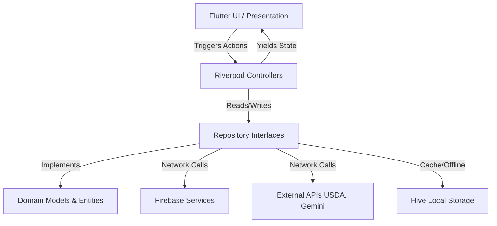
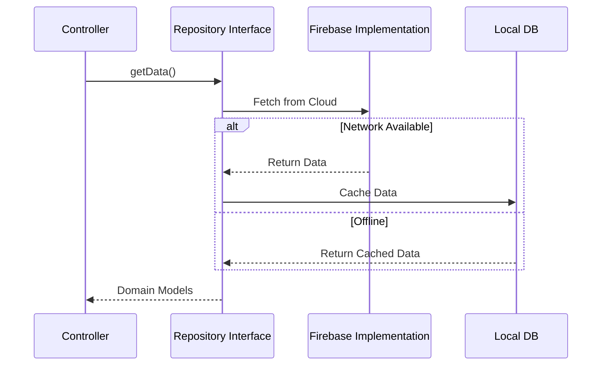

# Architecture & System Design

Xenova Health is engineered for scalability, maintainability, and testing. It employs a **Feature-First Clean Architecture** utilizing **Riverpod** for robust state management and dependency injection.

---

## System Architecture Diagram

---

## Clean Architecture Philosophy

The application is strictly separated into independent layers, minimizing the blast radius of changes.

1. **Presentation Layer (UI & State)**
   - Contains Flutter Widgets, Pages, and Riverpod `Notifier` classes.
   - **Rule**: UI files cannot directly communicate with Repositories. All logic routes through Controllers.
2. **Domain Layer (Business Logic)**
   - Contains plain Dart classes (Models, Entities via `Freezed`) and abstract Repository Interfaces.
   - **Rule**: Completely independent of any external packages (Firebase, Flutter UI, APIs).
3. **Data Layer (Implementation)**
   - Contains the concrete implementations of the Repository interfaces.
   - **Rule**: Responsible for taking raw data from Firebase/REST APIs and transforming it into Domain Models.

---

## Data Flows

### State Management Flow
We rely heavily on Riverpod's `AsyncNotifier` for predictable, asynchronous state.
1. The UI watches a `provider` (e.g., `weightControllerProvider`).
2. When loading, it shows a `CircularProgressIndicator`.
3. The Controller asks the Data layer for data.
4. Data is fetched, the Controller state is updated, and the UI reacts seamlessly.

### Repository Flow

### AI Coach Flow
The Gemini AI integration uses a specialized **Context Builder**.
1. The user sends a chat message.
2. The `AICoachController` fetches the user's recent weight, meals, and fasting data.
3. This context is injected into a "System Prompt" alongside the user's message.
4. The Gemini API processes the prompt and returns highly personalized, context-aware coaching advice.

### Notification Flow
- **Local**: Scheduled reminders for fasting and water.
- **Remote**: Firebase Cloud Messaging (FCM) handles broad alerts.
- **In-App**: The `NotificationRepository` tracks a user's unread badges, triggering a reactive red dot on the Dashboard Bell icon.

### Analytics Flow
All major user interactions (logging a meal, starting a fast, AI chat) trigger events in the `AnalyticsService`. These events are piped directly into Firebase Analytics, allowing us to build retention funnels and usage dashboards.
